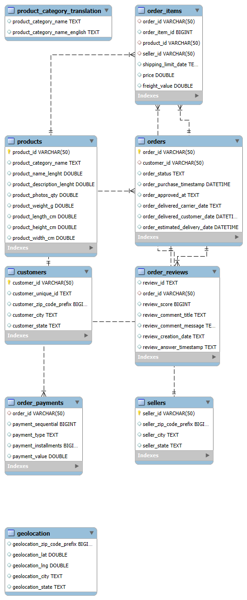

# Olist E-Commerce SQL Analysis

## Business Context
Olist is Brazil's largest e-commerce marketplace, connecting small businesses 
to customers across Brazil. This project analyzes 100,000+ real orders from 
2016-2018 across 9 relational tables to answer critical operational and 
strategic business questions.

I approached this as the data analyst for Olist's operations team — not as 
someone exploring a dataset, but as someone responsible for finding actionable 
insights that drive decisions.

---

## Business Problems Investigated

1. **Delivery Performance** — Where are we failing customers on delivery time 
   and how badly does it hurt our ratings?
2. **Customer Retention** — Are customers coming back after their first order?
3. **Seller Quality** — Which sellers are assets and which are liabilities?
4. **Revenue vs Satisfaction** — Are our highest revenue categories also our 
   best reviewed ones?
5. **Payment Behavior** — How does payment method affect order value?

---

## Dataset
- **Source:** [Brazilian E-Commerce Public Dataset by Olist](https://www.kaggle.com/datasets/olistbr/brazilian-ecommerce)
- **Size:** 100,000+ orders, 9 tables, 2016-2018
- **Tables:** orders, order_items, order_payments, order_reviews, customers, 
  sellers, products, product_category_translation, geolocation

---

## Key Findings

### 1. Delivery Delay Destroys Review Scores
| Delivery Status | Orders | Avg Review Score |
|---|---|---|
| Early | 88,658 | 4.29 |
| On Time | 1,291 | 4.03 |
| 1-3 Days Late | 1,856 | 3.29 |
| 4-7 Days Late | 1,756 | 2.10 |
| 8-14 Days Late | 1,453 | 1.68 |
| Over 14 Days Late | 1,345 | 1.72 |

**Insight:** The critical threshold is 3 days. Beyond that, review scores 
collapse from 3.29 to 2.10 — a full point drop. After 8 days late, scores 
plateau around 1.7 regardless of how much later the order arrives. Olist 
should treat 3-day delay as the intervention trigger, not delivery failure.

---

### 2. Customer Retention is Near Zero
- Jan 2017 cohort: 764 first-time customers → only 6 returned 12 months later
- Retention rate across all cohorts: approximately **0.5-1%**
- Olist is almost entirely dependent on new customer acquisition

**Insight:** Either customers are one-time category buyers (furniture, 
appliances) or there is a significant loyalty and retention program gap. 
This is the single biggest strategic risk in the business.

---

### 3. Best Spenders Are Leaving
RFM Segmentation results:

| Segment | Customers | Avg Spend | Avg Days Since Order |
|---|---|---|---|
| Needs Attention | 34,989 | R$139.79 | 117 |
| Champions | 22,758 | R$139.10 | 454 |
| Loyal Customers | 16,427 | R$139.35 | 296 |
| Potential Loyalists | 7,493 | R$149.73 | 256 |
| At Risk | 7,493 | R$144.92 | 135 |
| Lost | 4,198 | R$159.10 | 59 |

**Insight:** Lost customers have the highest average spend (R$159) — higher 
than Champions (R$139). Olist is losing its best customers, not its worst. 
Retention efforts should target high-spend customers before they churn, 
not after.

---

### 4. Geography Drives Delivery Failure
- AL (Alagoas): 23.9% late delivery rate
- MA (Maranhão): 19.7% late delivery rate
- SP (São Paulo): 5.9% late delivery rate despite 40,000+ orders

**Insight:** Late delivery correlates directly with distance from São Paulo, 
where most sellers are based. This is a logistics infrastructure problem, 
not a seller behavior problem. Northern and northeastern states need 
dedicated fulfillment solutions.

---

### 5. High Revenue ≠ High Satisfaction
- Health & Beauty: #1 in revenue (R$1.25M) but not #1 in order volume
- Bed Bath & Table: Most orders (9,417) but only 3rd in revenue
- Office Furniture: Lowest review score (3.49) despite stable order volume

**Insight:** Volume and value are decoupled across categories. Review scores 
signal product-market fit problems that revenue numbers hide.

---

### 6. Seller Health Score
Built a composite seller ranking combining revenue rank, review score rank, 
and delivery reliability rank into a single health score.

**Key finding:** Late delivery rate is a stronger predictor of seller health 
than revenue or review score. No seller with a high late rate appears in the 
top health rankings regardless of revenue. Olist should use late delivery 
rate as its primary early warning metric — it's the leading indicator, 
reviews are the lagging indicator.

---

## SQL Techniques Used
- CTEs (Common Table Expressions)
- Window Functions — RANK(), NTILE(), ROW_NUMBER()
- Cohort Analysis
- RFM Segmentation
- Conditional Aggregation with CASE WHEN
- Multi-table joins (4+ tables)
- EXPLAIN analysis for query optimization
- Index design and performance tuning
- Date arithmetic with DATEDIFF and DATE_FORMAT

---

## Project Structure
